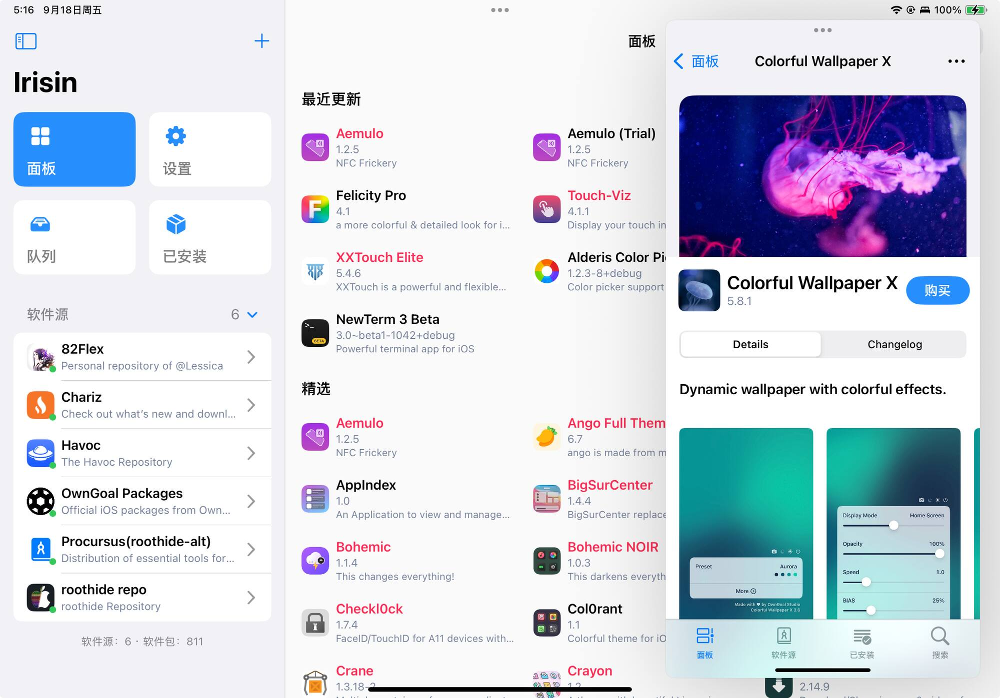

# Irisin

## Modern. Fast. Beautiful.

Irisin is a modern APT package manager for jailbroken devices running iOS/iPadOS 15 and above.

One binary serves both **rootless** (Dopamine, `/var/jb`) and **roothide** bootstraps. The app runs as `mobile` and never as root: the package ships a small on-demand LaunchDaemon, `irisind`, which authenticates the app over XPC and starts `irisin-install` for one job at a time. That helper installs packages natively and registers app bundles with LaunchServices itself, through [icli](https://github.com/owngoal-dev/icli) linked in as a library, in its own session, so even an Irisin self-update runs to the end. See `AGENTS.md` for the rules and `Packages/IrisinKit` for the wire protocol.



## Irisin Features

- [x] Unique UI for **both** iPhone and iPad
- [x] Import all your repositories from Cydia, Sileo, Zebra, and Installer
- [x] Add and manage repositories without limitation
- [x] Built to work alongside all your other package managers
- [x] Support for Web Depictions with dark mode
- [x] Support for Native Depictions with dark mode
- [x] Support for paid packages
- [x] Clear Version Control page listing all available versions and repositories
- [x] Clean and stable packaging using CI
- [x] Random device info for free packages
- [x] Fully open-sourced under the MIT License
- [x] Quick actions (respring, rebuild icons, safe mode) via the Settings page

## Bug Reports, Feature Requests, & Feedback

For support related to Irisin, open up an issue. Before reporting an issue, check if it has already been reported to avoid duplicates.

If your issue is related to a crash, attach the application log, typically located at `/var/mobile/Documents/wiki.qaq.irisin/Journal/`. This plain text document may include sensitive information (e.g., searched text, repository URLs), so review it before uploading.

## Compiling the Project

Open `Irisin.xcodeproj` for development. For packages:

```sh
make harness      # IrisinKit tests on the Mac
make deb-all      # roothide and rootless .deb, ad-hoc signed and verified
make install      # update a device behind `iproxy 2333 22`
```

`ldid` and `dpkg` from Homebrew are required. Versions live in `Configuration/Version.xcconfig`.

- This product includes software developed by the Sileo Team.

#### "While the world sleeps, we dream."

## Sponsor

[LookInside](https://lookinside-app.com/) helps you inspect a running iOS or macOS app UI from your Mac.

---

Copyright © 2024 OwnGoal Studio. All Rights Reserved.
